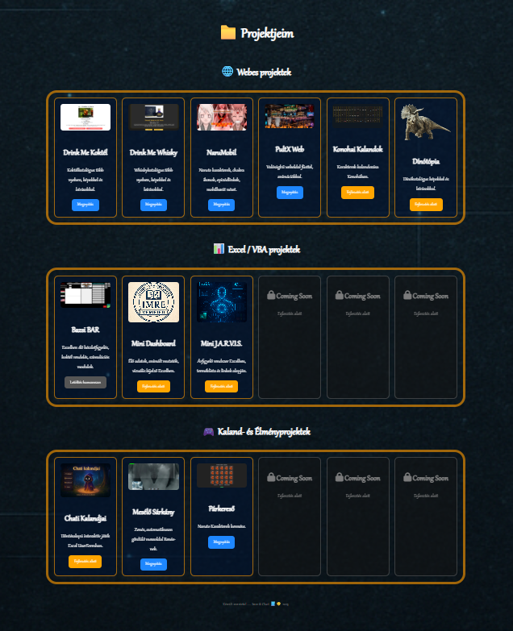

# 📁 ImreCodex – Projektgaléria

Üdvözöllek a személyes projektgyűjteményemben!  
Ez az oldal bemutatja az eddigi saját fejlesztésű **Webes**, **Excel/VBA**, valamint **Kaland- és Élményprojektek** vizuális gyűjteményét.

---

## 🖼️ Projektáttekintés

Az oldal célja, hogy egy helyen, áttekinthető módon mutassa be az összes aktív és készülő projektet.

---

## 🌐 Webes projektek

| Projekt | Leírás |
|--------|--------|
| **Drink Me Koktél** | Webes koktélkatalógus több nyelven, szűréssel, képekkel |
| **Drink Me Whisky** | Whiskyk adatlapos bemutatója |
| **NaruMobil** | Naruto karakterkártyák és kalandjáték (mobilos nézet) |
| **PultX Web** | Bár rendszer webes prototípusa |
| **Konohai Kalandok** | Karakterfüggő Naruto kalandjáték |
| **Dínótópia** | Gyermekbarát dinoszaurusz adatbázis és bemutató |

---

## 📊 Excel / VBA projektek

| Projekt | Leírás |
|--------|--------|
| **Bazsi BAR** | Italraktár és fogyasztás nyilvántartó rendszer |
| **Mini Dashboard** | Élő adatok, színkódolt mutatók, dinamikus felület |
| **Mini J.A.R.V.I.S.** | Árfigyelő rendszer Excelből, adatbáziskezeléssel |
| *Coming Soon* | Új Excel-alapú rendszer előkészületben... |

---

## 🎮 Kaland- és Élményprojektek

| Projekt | Leírás |
|--------|--------|
| **Chati Kalandjai** | Választható ösvényes történetjáték UserFormon |
| **Mesélő Sárkány** | Automatikus gördülő mesehangulat zenével |
| **Párkereső** | Kép-alapú memóriajáték HTML/JS alapon |
| *Coming Soon* | Új élményprojekt fejlesztés alatt... |

---

## 🔒 Coming Soon kártyák

A még fejlesztés alatt álló projektkártyák `🔒 Coming Soon` jelzést kaptak, inaktív stílusban. Ezek hamarosan elérhetővé válnak, folyamatosan frissítem a galériát.

---

## 📧 Elérhetőség

Ha kérdésed van, vagy érdekel valamelyik projekt technikai háttere, nyugodtan keress meg:

📩 **laptopimre@gmail.com**

---

## 🔖 Licenc

Ez a galéria személyes projektek bemutatására készült. Minden kép, szöveg és adat saját fejlesztésű vagy szabadon felhasználható forrásból származik.

